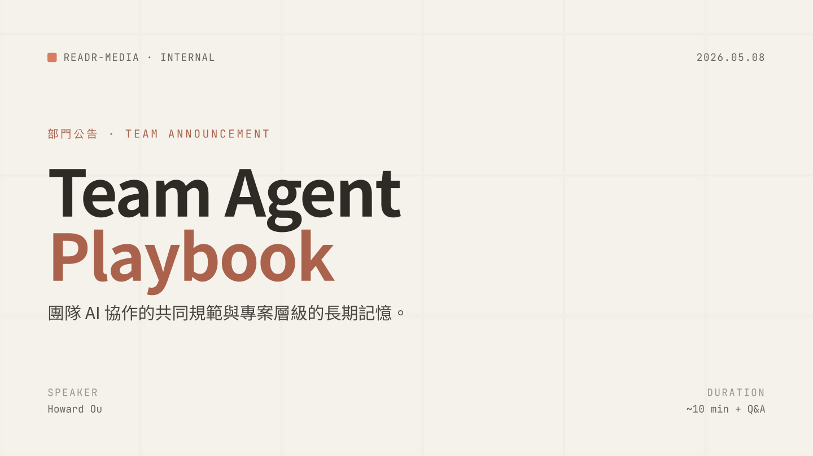

# team-agent-playbook

團隊 AI 輔助開發的共同規範。一份 canonical 的 [`AGENTS.md`](https://agents.md/) 透過 GitHub Actions 自動同步進每個團隊 repo，讓 Claude Code、Gemini CLI、Codex CLI、Cursor 等 AI 工具都讀到相同的團隊標準。

## 快速了解

[](docs/team-agent-playbook-slides.pdf)

點封面開 PDF（~10 分鐘）。

## 架構

```
readr-media/team-agent-playbook       ← canonical（public，本 repo）
  ├─ mirror-media/team-agent-playbook ← fork
  ├─ mirror-tv/team-agent-playbook    ← fork
  └─ mirrordaily/team-agent-playbook  ← fork
```

每個 org 在自家 fork 安裝獨立的 GitHub App 執行同步，token 範圍限縮在該 org，跨 org 互不影響。target repos 透過 GitHub topic `team-agent-playbook-managed` 自動發現，不需中央清單。

實作細節（sync 流程、檔案結構、設計決策）見 [SPEC.md](SPEC.md)。

---

## 步驟指引

### 情境 1：org 要納入這套規範（fork canonical）

**對象**：org admin。每個 org 做一次。

1. **Fork canonical 到自家 org**
   ```sh
   gh repo fork readr-media/team-agent-playbook --org <your-org> --remote=false
   ```
   或在網頁 fork。fork 後是 `<your-org>/team-agent-playbook`。

2. **啟用 fork 的 Actions** ⚠️ **大坑**
   GitHub fork 預設**停用 Actions**。到 fork 的 Actions 頁面按 **「I understand my workflows, go ahead and enable them」**。

3. **建 GitHub App（在你的 org 名下）**
   前往 `https://github.com/organizations/<your-org>/settings/apps/new`，填：
   - **Name**：`team-agent-playbook-sync-<your-org>`（GitHub 全域唯一，被佔用就換字尾）
   - **Webhook → Active**：取消勾選
   - **Repository permissions**：Contents = Read and write、Pull requests = Read and write，其他 No access
   - **Where can this GitHub App be installed**：Only on this account

   建好後：
   - 取得 **Client ID**（App settings 頁面，或 `gh api /apps/<app-slug> --jq .client_id`）
   - **Generate a private key**，下載 `.pem`
   - **Install App** → 自家 org → **All repositories**

4. **把 App 認證注入 fork**
   ```sh
   gh variable set SYNC_APP_CLIENT_ID \
     --repo <your-org>/team-agent-playbook \
     --body "<client_id>"

   gh secret set SYNC_APP_PRIVATE_KEY \
     --repo <your-org>/team-agent-playbook \
     < /path/to/private-key.pem
   ```

5. **驗證**
   到 fork 的 Actions → `Sync AGENTS.md to target repos` → **Run workflow**。
   應該成功完成、印 `no target repos found` warning（正常，還沒有 repo 加 topic）。

完成。之後納入 repo 走情境 2。

---

### 情境 2：把專案納入管理

**對象**：project maintainer。每個 repo 做一次。

1. **本機 clone 你的 fork**（如果還沒）
   ```sh
   gh repo clone <your-org>/team-agent-playbook
   ```

2. **對 target repo 跑 init.sh**
   ```sh
   bash team-agent-playbook/scripts/init.sh /path/to/your/repo
   ```
   會做：複製 `templates/SPEC.md`（已存在則 skip）、把 `AGENTS.local.md` 加進 `.gitignore`。

3. **Commit + push 該 scaffold**
   ```sh
   cd /path/to/your/repo
   git add SPEC.md .gitignore
   git commit -m "chore: scaffold for team-agent-playbook managed sync"
   git push
   ```

4. **加 topic**
   ```sh
   gh repo edit <your-org>/<your-repo> --add-topic team-agent-playbook-managed
   ```

5. **手動觸發 sync workflow**
   到 `<your-org>/team-agent-playbook` 的 Actions → `Sync AGENTS.md to target repos` → **Run workflow**。

6. **Review + merge sync PR**
   workflow 跑完會在你 repo 開一個 PR，title `chore: sync AGENTS.md base (commit <hash>)`，內含 `AGENTS.md`、`CLAUDE.md`、`.gemini/settings.json`。Review，merge。

完成。之後 canonical 變動會自動傳到這個 repo（見情境 4）。

---

### 情境 3：把已有 AGENTS.md 衝突的舊專案遷移進來

**對象**：repo 已經有 `AGENTS.md` 但**沒有** TEAM-BASE 標記，sync 會印 warning 並略過。

1. **盤點現有 AGENTS.md**
   把規則分兩類：
   - 屬於團隊共用的（PR 規範、code review、git workflow 等）→ 待會丟掉，由 canonical 提供
   - 屬於專案特有的（架構慣例、特殊限制）→ 待會搬到 Project Customization

2. **改寫 AGENTS.md 結構**
   ```markdown
   <!-- TEAM-BASE-START -->
   <!-- 內容暫時留空 OK，下次 sync 會被填入 base/AGENTS.md 內容 -->
   <!-- TEAM-BASE-END -->

   ## Project Customization

   <!-- 把專案特有規則貼進這裡 -->
   ```

3. **Commit + push**

4. **後續走情境 2 步驟 2-6**（init.sh、加 topic、觸發 sync、merge PR）

   第一次 sync 會把 TEAM-BASE 區塊填上 canonical 內容，`## Project Customization` 保留不動。

---

### 情境 4：canonical 更新 base 之後的傳遞流程

base 變更要走兩階段：canonical → fork → target repos。

**(a) canonical 維護者**（`readr-media/team-agent-playbook`）

1. 開 PR 編輯 `base/AGENTS.md`（或 `base/CLAUDE.md`、`base/.gemini/settings.json`）
2. PR title 用 conventional 格式（`feat:` / `fix:` / `chore:` 等）
3. 如果變更會讓既有 `## Project Customization` 失效（例如改 marker 語法、刪除關鍵章節），title 加 `[BREAKING]` prefix，body 寫遷移路徑
4. 至少 1 位 maintainer approval、merge → readr-media 的 Action 自動執行，對 readr-media 內每個納管 repo 開 sync PR

**(b) fork 維護者**（mirror-media、mirror-tv、mirrordaily）

⚠️ canonical 變更**不會自動傳到 fork**，fork 要主動拉。

1. 到 fork 頁面點 **「Sync fork」**，或：
   ```sh
   gh repo sync <your-org>/team-agent-playbook
   ```
2. fork 的 main 收到上游 commit → fork 的 Action 自動執行
3. 自家 org 內每個納管 repo 收到 sync PR

**(c) target repo maintainer**（每個納管 repo）

收到 sync PR 後 review + merge。重點：
- TEAM-BASE 區塊看新規則內容是否合理
- `## Project Customization` 應維持原樣（如果動了表示 sync 邏輯有 bug，回報給 canonical 維護者）

---

### 情境 5：對單一專案加 project-specific 規則

**對象**：想在這個 repo 套用某條規則、但不推到全 team 的 maintainer。

1. 編輯該 repo 的 `AGENTS.md`，**只動 `## Project Customization` 章節**：
   ```markdown
   ## Project Customization

   ### 我們專案特有的規則
   - 例：所有資料庫 migration 必須在 PR 描述附 rollback 步驟
   ```
2. Commit、push、走 PR review。

衝突仲裁：如果 Project Customization 與 TEAM-BASE 衝突，**Project rule 贏**（明寫 override）。詳見 `AGENTS.md` 的 Authority 章節。

⚠️ **絕對不要動 `<!-- TEAM-BASE-START -->` 與 `<!-- TEAM-BASE-END -->` 之間的內容**，下次 sync 會被覆蓋。

---

### 情境 6：個人本地 override（AGENTS.local.md）

**對象**：想在自己機器上 override 某條規則、不想 commit、不影響其他人的開發者。

1. 在 repo 根目錄建 `AGENTS.local.md`（已經 git-ignored，不會被 commit）
2. 寫個人偏好規則
3. 優先順序（高 → 低）：`AGENTS.local.md` > `## Project Customization` > TEAM-BASE > AI 工具預設

只你自己看得到，team 完全不受影響。

---

### 情境 7：把專案移出管理

**對象**：repo 不想再被 sync 覆蓋的時候。

1. 移除 topic：
   ```sh
   gh repo edit <your-org>/<your-repo> --remove-topic team-agent-playbook-managed
   ```
2. （可選）刪除 `AGENTS.md`、`CLAUDE.md`、`.gemini/settings.json`、`SPEC.md` 等 scaffold 檔

從此這個 repo 不會再被 sync。

---

## 故障排除

**Q：fork 的 Action 沒跑？**
A：GitHub fork 預設**停用 Actions**。到 Actions 頁面手動 enable。情境 1 步驟 2 細節。

**Q：加了 topic、觸發了 workflow，為什麼沒開 PR？**
A：可能原因：
- 該 repo 三檔（`AGENTS.md`、`CLAUDE.md`、`.gemini/settings.json`）已是最新內容，無 diff 不開 PR
- Action log 印 warning：archived repo 會 skip、無 TEAM-BASE markers 會 skip（走情境 3）

**Q：base 改了但 Action 沒自動跑？**
A：trigger paths 限定 `base/**`，只有 base 內檔案有變動才觸發。內部維運（scripts、workflow yaml、docs）不觸發。要強制重跑用 Actions → Run workflow。

**Q：某個 target repo 在 Action log 印 warning 被 skip？**
A：看訊息：
- `AGENTS.md exists without TEAM-BASE markers` → 走情境 3 遷移
- 權限錯誤 → 確認 App 安裝範圍包含該 repo（情境 1 步驟 3 應選 All repositories）
- archived → 解 archive 或直接跳過

**Q：merge 完 sync PR、本地工具還是讀舊規則？**
A：`git pull` 拿最新 main。AI 工具下次 session 重啟讀新檔。

---

## 長期耐久原則（canonical 維護者）

`base/AGENTS.md` 的維護者守住：

- **不綁工具版本**。`AGENTS.md` 跨多種工具，每家更新節奏不同。
- **不綁流程細節**。「PR 必須週四前 merge」這類東西不該寫進團隊憲法。
- **不把個人偏好包裝成規則**。只有一個人在意的事，不算團隊標準。
- **Breaking changes 一定要明確標示**。改 marker 語法、刪除關鍵章節等變更，title 加 `[BREAKING]`，body 寫遷移路徑。

---

## License

MIT — 見 [LICENSE](LICENSE)。
